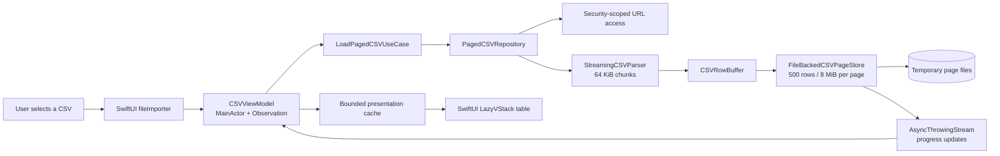
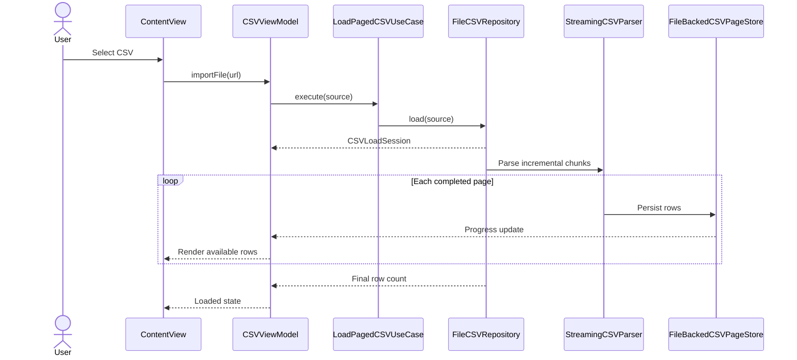

# CSV Viewer

CSV Viewer is a SwiftUI application created for the Rabobank Team Native assignment. It displays the bundled `issues.csv` on launch and imports user-selected CSV documents through the system file picker.

The project deliberately goes beyond loading an entire file into memory. Every document—small or large—travels through the same streaming, file-backed pipeline. Parsed rows are stored in pages on disk, while only a bounded set of visible and nearby pages remains in memory.

<p align="center">
  
</p>

## Highlights

- Strict Swift 6 concurrency checking and explicit `Sendable` boundaries.
- Incremental CSV parsing from 64 KiB chunks instead of whole-file loading.
- Explicit 1 MiB field, 4 MiB row, and 8 MiB page safety limits.
- File-backed pages with bounded in-memory caches for predictable memory use.
- Progressive UI updates while a document is still being parsed.
- Lazy vertical rendering, horizontal table scrolling, and page prefetching.
- Cancellation and stale-result protection when a newer import replaces an older one.
- Typed parser, storage, file-access, and user-facing error handling.
- Recoverable page-read errors with an in-context retry action.
- Explicit retry for failed bundled and imported document loads.
- Unit, integration, UI, and opt-in 50+ MB performance coverage.
- Clean Architecture boundaries without unnecessary framework targets.

## Tech Stack

| Area | Technology | Role in the project |
| --- | --- | --- |
| Language | Swift 6 | Strict concurrency checking, value semantics, protocols, and typed errors |
| UI | SwiftUI | Declarative screens, system document importer, lazy row rendering, and adaptive layout |
| State management | Observation (`@Observable`) | Main-actor view-model observation without a Combine dependency |
| Concurrency | `async`/`await`, `Task`, `Task.detached` | Responsive imports, cancellation, page loading, and work performed away from the main actor |
| Progressive delivery | `AsyncThrowingStream` | Publishes page and completion updates while parsing continues |
| Isolation | actors and `Sendable` | Protects mutable page-store state and makes cross-task contracts explicit |
| Persistence | `FileManager`, file-backed page store | Keeps parsed pages in temporary cache storage instead of retaining the full CSV in RAM |
| File access | SwiftUI `fileImporter`, security-scoped URLs | Imports documents selected outside the application sandbox and balances access correctly |
| Unit tests | Swift Testing | Parser, page store, repository, use-case, composition, and view-model coverage |
| UI/performance tests | XCTest / XCUITest | Launch and import smoke tests plus opt-in clock and memory metrics for a generated 50+ MB CSV |
| Dependency management | Constructor injection | Wires repository and use-case abstractions without a third-party DI framework |

The application intentionally has no third-party runtime dependencies.

## Requirements

- Xcode 27 or newer
- iOS 27 Simulator or device

## Run

1. Open `CSVViewer/CSVViewer.xcodeproj`.
2. Select the `CSVViewer` scheme and an iPhone or iPad destination.
3. Run the application.
4. Use **Import** to choose another CSV or text file.

From the repository root, build with:

```bash
xcodebuild build \
  -project CSVViewer/CSVViewer.xcodeproj \
  -scheme CSVViewer \
  -destination 'generic/platform=iOS Simulator' \
  CODE_SIGNING_ALLOWED=NO
```

Run the regular test suite with an installed simulator name:

```bash
xcodebuild test \
  -project CSVViewer/CSVViewer.xcodeproj \
  -scheme CSVViewer \
  -destination 'platform=iOS Simulator,OS=latest,name=iPhone 18 Pro' \
  -parallel-testing-enabled NO \
  CODE_SIGNING_ALLOWED=NO
```

## Architecture

The application uses Clean Architecture boundaries inside one application target:

```text
CSVViewer
├── App
├── Domain
│   ├── Entities
│   ├── Repositories
│   └── UseCases
├── Data
│   ├── FileAccess
│   ├── PageStore
│   ├── Parsers
│   └── Repositories
└── Presentation
    ├── ViewModels
    └── Views
```

| Layer | Responsibility | Depends on |
| --- | --- | --- |
| Domain | Loading session, progress events, entities, page-provider and repository contracts, use case, domain errors | Swift standard and Foundation types only |
| Data | Security-scoped access, incremental parsing, row buffering, disk-backed pages, cache eviction, and error mapping | Domain contracts |
| Presentation | Main-actor state machine, page-request coalescing, presentation cache, retry state, and SwiftUI views | Domain use case and contracts |
| App | Composition root and concrete dependency injection | All concrete layers |

These are logical modules rather than separate framework targets. One-way dependencies and protocol boundaries preserve testability and provide a clear path to extracting modules later, without adding build-system overhead that would be disproportionate for a take-home assignment.

### Dependency and data flow



The dependency direction points inward: SwiftUI does not parse files, the use case does not know about the filesystem, and the parser does not know about presentation state.

## Loading Lifecycle



`ContentView` requests the bundled document once at launch. Each later import creates a new loading generation. Starting a newer import cancels the previous producer, closes its page store, and prevents a slow stale result from replacing the current document. If a bundled or imported load fails, the view model retains that exact request and exposes an explicit **Retry** action; selecting a newer document replaces the retry target. A file-picker failure has no source to reload and therefore does not offer Retry.

The view model exposes explicit loading, streaming, loaded, empty, and failure states. Page reads are coalesced so concurrent requests for the same page share one task. A failed page remains retryable without discarding the document that is already visible.

## Large-File Strategy

The same pipeline is used regardless of file size; the included performance exercise verifies the production path with a generated document larger than 50 MB:

1. `FileCSVRepository` opens the selected source with balanced security-scoped access.
2. Parsing runs in a detached, user-initiated task so file I/O and parsing do not block the main actor.
3. `StreamingCSVParser` consumes 64 KiB chunks and emits complete records across chunk boundaries.
4. `CSVRowBuffer` completes a page at either 500 rows or an 8 MiB UTF-8 byte budget, without repeatedly shifting the front of an array.
5. `FileBackedCSVPageStore` serializes pages into a unique temporary cache directory and independently rejects encoded pages larger than 8 MiB as a defense-in-depth check.
6. The actor-backed store retains at most five recently used pages in memory.
7. `CSVViewModel` keeps a separate, bounded three-page presentation cache and prefetches near page boundaries.
8. `LazyVStack` materializes only the vertical rows required by the current viewport.
9. Cancellation, failure, or replacement closes the store and removes its temporary directory.

For ordinary valid input, memory therefore scales primarily with chunk, byte-bounded page, and cache sizes rather than total row count. Disk usage still scales with the parsed document, which is an explicit trade-off for predictable memory behaviour and random page access.

Row and page counts alone cannot bound memory when a valid CSV cell is extremely large. The production defaults therefore reject a field above 1 MiB and a record above 4 MiB while parsing, before either value can grow without limit. Pages are bounded independently at 8 MiB during row buffering and again after serialization. These limits are pathological-input safeguards, not a separate large-file mode: a multi-gigabyte document containing reasonably sized records still uses the same streaming, file-backed pipeline.

## Concurrency and Safety

- `CSVViewModel` is main-actor isolated because it owns UI-observed state.
- The producer task is detached from the main actor and owns blocking file I/O and parsing work.
- `AsyncThrowingStream` transports progressive results and terminal failures back to the consumer.
- `FileBackedCSVPageStore` is an actor, serializing mutable cache, recency, and lifecycle state.
- Domain and data contracts crossing isolation boundaries conform to `Sendable` where appropriate.
- Cooperative cancellation is checked throughout parsing and page production.
- Request generations stop earlier tasks from publishing into a newer UI session.
- Security-scoped access is always stopped after success, cancellation, or failure.

Observation is used directly; Combine is not required for view-model publication.

## CSV Behaviour

The parser supports:

- comma-separated fields;
- quoted fields and commas inside quotes;
- escaped double quotes (`""`);
- line breaks inside quoted fields;
- LF and CRLF record endings;
- an optional UTF-8 byte-order mark;
- empty and trailing fields;
- a final record without a terminating newline.

The first record is the header. Short rows are padded with empty values. Rows wider than the header, unterminated quoted fields, quotes inside unquoted fields, unexpected characters after a closing quote, and non-UTF-8 input produce typed errors rather than silently losing or changing data.

Values matching the supported ISO-style date representation are formatted for display while the underlying CSV value remains unchanged.

## Error Handling

Errors are translated at the boundary where useful context exists:

- parser errors describe malformed CSV grammar or invalid UTF-8;
- resource-limit errors identify fields, records, or encoded pages that exceed the configured memory-safety budgets;
- page-store errors describe invalid pages, unavailable rows, decoding, or closed-store access;
- repository errors map missing bundle resources and file-reading failures;
- presentation state converts failures into concise user-facing messages;
- page-read failures preserve the current table and show a retry banner.
- full-load failures retain the exact bundled or imported request and expose an explicit Retry action.

This keeps diagnostics specific without leaking filesystem or parser implementation details into SwiftUI views.

## Testing

The project uses Swift Testing for unit and integration coverage and XCTest for UI and performance coverage.

- Streaming-parser tests cover chunk boundaries, valid syntax, multiline data, BOM handling, row normalization, malformed quote grammar, encoding errors, and oversized fields and records.
- Row-buffer tests verify row-count and byte-budget page boundaries, oversized rows, remainder handling, and compaction behaviour.
- Page-store tests cover persistence, encoded-size enforcement, bounded memory caching, reloads, cleanup, invalid access, and cancellation.
- Repository tests cover progressive page publication, resource-limit error mapping, cancellation, and security-scoped access cleanup.
- Use-case tests verify repository delegation and error propagation.
- View-model tests cover state transitions, progressive updates, request coalescing, bounded presentation caching, initial-load and page retry, replacement, and stale-result protection.
- The composition test loads the bundled sample through the real dependency graph.
- UI tests verify launch, the import action, compact lazy-table layout, horizontal scrolling, navigation styling, and the full-load Retry cycle.
- The opt-in performance test generates and validates a deterministic 50+ MB document using the real production pipeline.

### Large-file performance exercise

The large-file test creates its fixture incrementally in a temporary directory, verifies the final row count plus sampled first, middle, and last rows, checks cache bounds and cleanup, and records XCTest clock and memory metrics:

```bash
xcodebuild test \
  -project CSVViewer/CSVViewer.xcodeproj \
  -scheme CSVViewer \
  -destination 'platform=iOS Simulator,OS=latest,name=iPhone 18 Pro' \
  CODE_SIGNING_ALLOWED=NO \
  'SWIFT_ACTIVE_COMPILATION_CONDITIONS=$(inherited) RUN_LARGE_CSV_PERFORMANCE_TEST' \
  -only-testing:CSVViewerTests/CSVLargeFilePerformanceTests/testFiftyMegabyteCSVPerformance
```

The test is skipped during the regular fast suite unless the compilation condition is supplied. Duration and memory measurements depend on the host and simulator, so this is a diagnostic exercise rather than a brittle universal performance threshold. It complements—but does not replace—the deterministic tests for field, row, page, and cache bounds. No generated fixture is stored in the repository.

## Design Decisions and Trade-offs

- **Logical modules instead of framework targets:** preserves architectural boundaries while keeping the assignment simple to build and review.
- **File-backed pages for every file:** one deterministic code path avoids a size threshold with two subtly different behaviours.
- **Bounded caches:** predictable memory use costs occasional page decoding when the user scrolls far back.
- **Byte-based safety budgets:** reject pathological single values and very wide records instead of allowing row-count limits to imply a false memory guarantee.
- **Disk-backed random access:** supports large row counts but consumes temporary disk space proportional to the parsed data.
- **SwiftUI lazy vertical rendering:** is sufficient for the expected column counts, while avoiding a UIKit bridge and its additional state synchronisation.
- **Progressive indexing:** users see rows before parsing finishes, but the final total is unknown until completion.
- **Strict CSV grammar:** rejects ambiguous input early instead of attempting lossy recovery.

## Current Limitations

- The delimiter is fixed to a comma.
- Files must use UTF-8 encoding.
- Imported documents and their temporary page stores are not restored on the next launch.
- The viewer does not edit, search, sort, filter, or export data.
- Date recognition intentionally covers a narrow known format rather than attempting locale-dependent inference.
- Rows and backing storage are lazy and bounded, but every column of a visible row is rendered. Documents with hundreds or thousands of columns are outside the optimized scope of this take-home project.
- Performance metrics are collected manually and are not yet tracked against a CI baseline.

## Possible Improvements

The existing boundaries make the following improvements incremental rather than architectural rewrites:

### Product and usability

- Add localization, starting with Dutch and English strings, locale-aware dates, and pluralization.
- Add search, column sorting, filters, frozen headers, cell selection, copy, and a focused full-value detail view.
- Add delimiter selection or automatic detection for comma, semicolon, and tab-separated documents.
- Support additional encodings with explicit detection and a user-visible override.
- Add export and share actions for filtered or transformed results.
- Expand accessibility coverage: VoiceOver table context, keyboard navigation, higher contrast, and broader Dynamic Type validation.
- Adapt the table for iPad multitasking and consider a macOS target.

### Persistence and local storage

- Store security-scoped bookmarks for recent documents so users can reopen them after relaunch with explicit permission.
- Persist lightweight session metadata such as source name, scroll position, selected column, and active filters.
- Reuse validated page indexes across launches when the source file identity, size, and modification date are unchanged.
- Add cache quotas, expiry, and disk-pressure cleanup for persistent indexes.

### Scale and performance

- Add horizontal column virtualization if real usage includes hundreds or thousands of columns.
- Make page size, chunk size, prefetch distance, and cache capacity adaptive to device memory and observed row width.
- Add parsing progress based on bytes consumed and expose cancellation directly in the UI.
- Move index generation into a resumable background workflow for extremely large imports.
- Benchmark pathological inputs such as very wide rows, multiline quoted fields, and long individual values.

### Delivery and maintainability

- Add CI for build, unit tests, UI smoke tests, linting, and opt-in scheduled performance runs.
- Store performance baselines per simulator class and flag statistically meaningful regressions.
- Add structured diagnostics and privacy-safe performance telemetry if the application becomes a production product.
- Extract Domain, Data, and Presentation into separate packages or framework targets only when independent ownership, reuse, or build times justify the extra boundaries.
